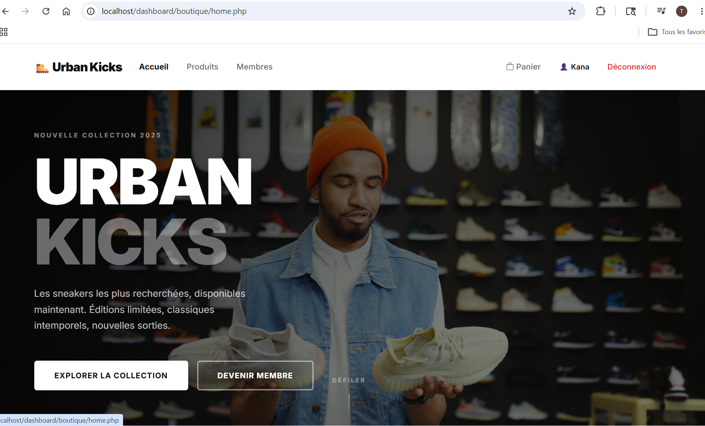
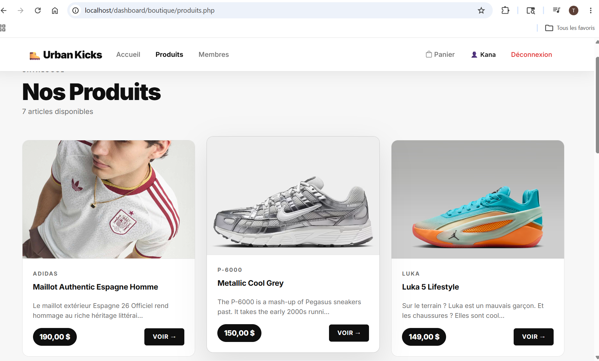
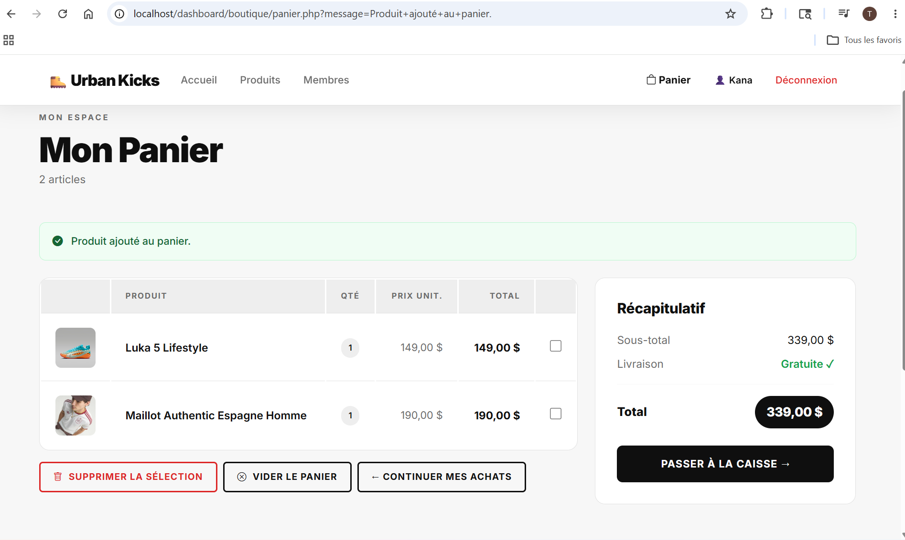
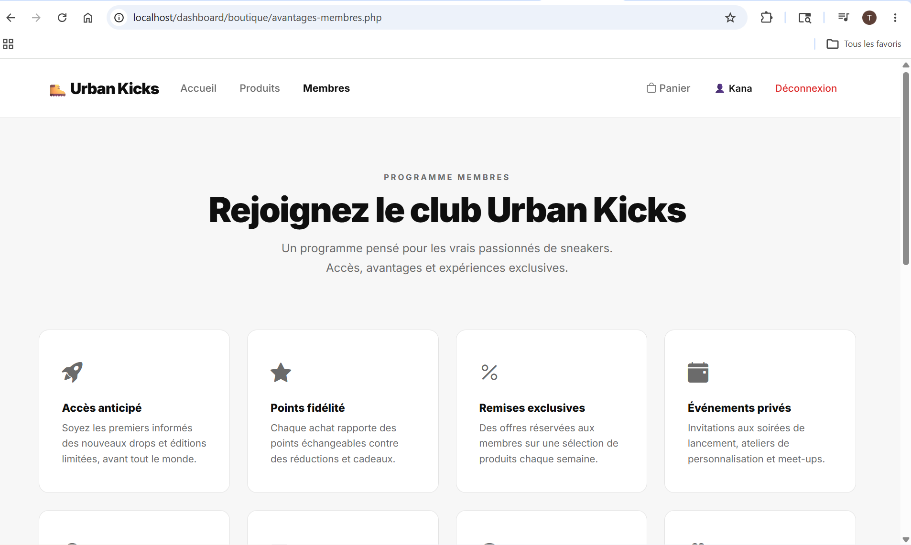
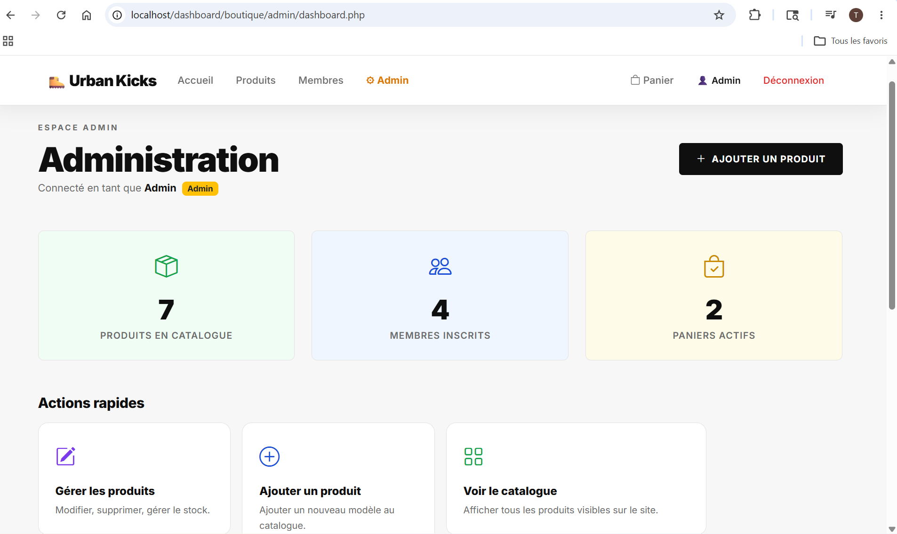
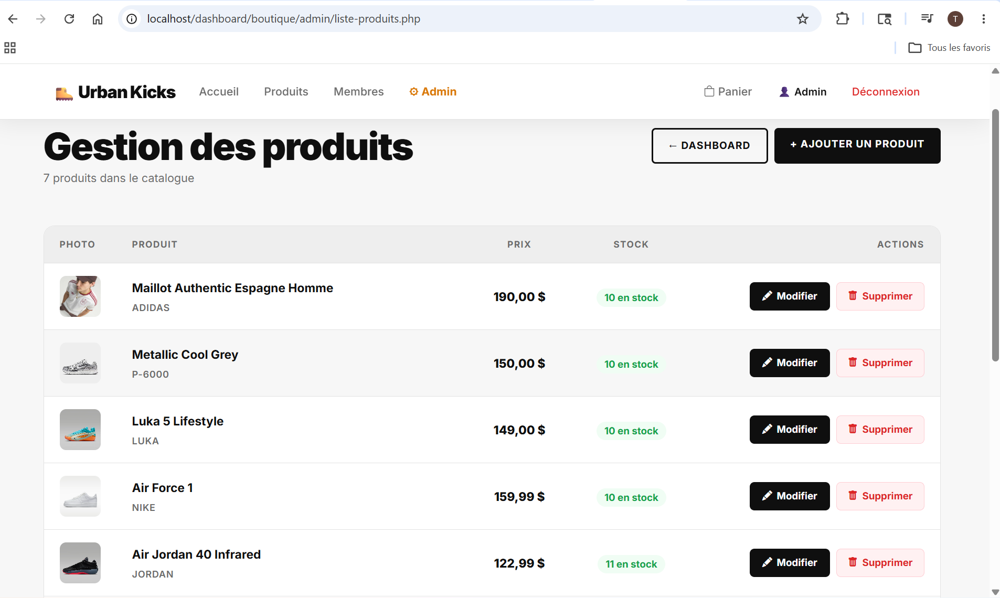

# 🥾 Urban Kicks


> Boutique e-commerce de sneakers développée en PHP natif — sans framework, sans ORM, du vrai code.

---

## 📸 Aperçu

| Page | Capture |
|------|---------|
| Accueil — Hero vidéo & produits vedettes |  |
| Catalogue — Grille de produits dynamique |  |
| Panier — Récapitulatif & paiement PayPal |  |
| Avantages membres |  |
| Dashboard admin — Statistiques |  |
| Gestion produits — CRUD complet |  |

---

## ✨ Fonctionnalités

**Côté client**
- 🛍️ Catalogue de produits chargé dynamiquement depuis MySQL
- 🔍 Fiche détail par produit
- 🔐 Inscription sécurisée avec hashage `password_hash()` (bcrypt)
- 🔑 Connexion avec `password_verify()` + gestion de session PHP
- 🛒 Panier persistant par utilisateur (stocké en base de données)
- 💳 Paiement intégré via PayPal Sandbox

**Côté admin** *(accès protégé par session + rôle)*
- 📊 Tableau de bord avec statistiques en temps réel
- ➕ Ajout de produits (nom, marque, prix, stock, image)
- ✏️ Modification de produits avec aperçu image en direct
- 🗑️ Suppression avec confirmation JavaScript
- 📋 Liste complète du catalogue avec badges de stock

---

## 🛠️ Stack technique

| Couche | Technologie |
|--------|-------------|
| Back-end | PHP 8 natif (zéro framework) |
| Base de données | MySQL 8 — requêtes préparées (`mysqli` OO) |
| Front-end | Bootstrap 5.3 + CSS custom (variables `:root`) |
| JavaScript | Vanilla JS — IntersectionObserver, animations scroll |
| Typographie | Inter (Google Fonts) |
| Paiement | PayPal SDK (mode sandbox) |
| Serveur local | XAMPP (Apache + MySQL) |

---

## 🚀 Installation

### Prérequis

- [XAMPP](https://www.apachefriends.org/) ≥ 8.0 (Apache + MySQL)
- Git

### Étapes

**1. Cloner le dépôt**
```bash
git clone https://github.com/kana-di/urban-kicks.git C:/xampp/htdocs/dashboard/boutique
```

**2. Importer la base de données**
```
→ Démarrer Apache et MySQL via XAMPP Control Panel
→ Ouvrir http://localhost/phpmyadmin
→ Onglet SQL → coller le contenu de database/urban_kicks.sql → Exécuter
```

**3. Configurer les clés API**
```bash
cp includes/config.example.php includes/config.php
# Éditer config.php et renseigner votre clé PayPal sandbox
```

**4. Lancer le projet**
```
http://localhost/dashboard/boutique/home.php
```

---

## 🔐 Comptes de démonstration

Les identifiants (email + mot de passe hashé) sont fournis dans `database/urban_kicks.sql`.

> ⚠️ Les comptes de démo sont à usage local uniquement. Remplacez-les avant tout déploiement.

---

## 📁 Structure du projet

```
boutique/
│
├── home.php                   ← Accueil (hero vidéo, produits vedettes)
├── produits.php               ← Catalogue dynamique
├── detail_produit.php         ← Fiche produit
├── login.php                  ← Connexion / logout
├── inscription.php            ← Création de compte (bcrypt)
├── panier.php                 ← Gestion du panier
├── paiement.php               ← Paiement PayPal sandbox
├── avantages-membres.php      ← Programme membres
├── index.php                  ← Redirect → home.php
│
├── admin/
│   ├── dashboard.php          ← Tableau de bord (stats)
│   ├── liste-produits.php     ← Catalogue admin + actions
│   ├── ajouter-produit.php    ← Formulaire ajout
│   └── modifier-produit.php   ← Formulaire modification
│
├── actions/                   ← Scripts de traitement (POST, sans HTML)
│   ├── ajout_panier.php
│   ├── vider_panier.php
│   ├── sup_panier.php
│   └── supprimer_produit.php
│
├── includes/                  ← Composants réutilisables
│   ├── db.php                 ← Connexion MySQL centralisée
│   ├── header.php             ← Navbar + CSS global + session
│   ├── footer.php             ← Footer + animations JS
│   ├── config.php             ← Clés API (exclu de Git)
│   └── config.example.php     ← Template de configuration
│
├── database/
│   └── urban_kicks.sql        ← Structure BD + données de démo
│
└── image/
    └── screenshots/           ← Captures d'écran du projet
```

---

## 🎓 Ce que ce projet m'a appris

- **Architecture sans framework** — organiser un projet PHP en couches (pages, actions, includes) sans dépendances externes
- **Sécurité des mots de passe** — hashage bcrypt avec `password_hash()` et vérification avec `password_verify()`
- **Requêtes préparées** — prévention des injections SQL avec `mysqli` en mode orienté objet
- **Gestion de sessions** — authentification, rôles (client / admin), protection de routes
- **Intégration d'API tierce** — connexion au SDK PayPal Sandbox, gestion des callbacks de paiement
- **Design system CSS** — variables `:root`, thème clair cohérent, composants réutilisables
- **UX progressive** — animations au scroll via `IntersectionObserver`, navbar réactive, aperçu image en direct
- **Rigueur Git** — `.gitignore` adapté, séparation config/code, documentation

---

## 👨‍💻 Auteur

**Kana Diallo**  
Étudiant — DEC Techniques de l'informatique  
Institut Teccart, Montréal  
📧 [kanadiallo20@gmail.com](mailto:kanadiallo20@gmail.com)  
🐙 [github.com/kana-di](https://github.com/kana-di)

---

*Projet académique · Institut Teccart · DEC Techniques de l'informatique · 2025*
